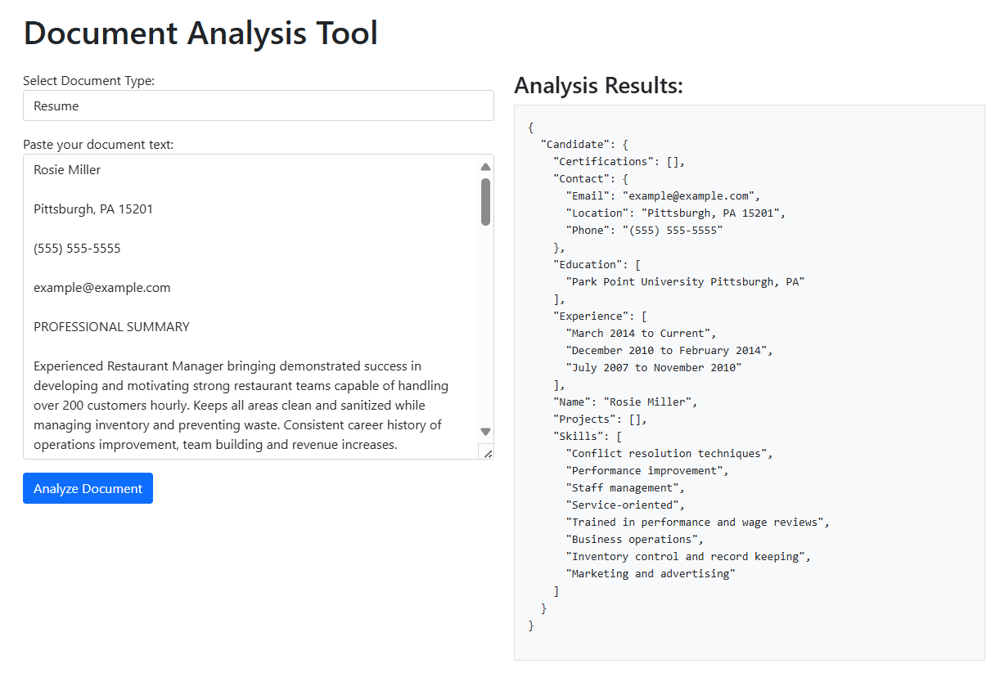

# Document Analysis Tool

A powerful tool that uses NuExtract v1.5 to automatically extract structured information from various types of documents, including research papers and resumes.

## Features

- Extract structured information from unstructured text
- Support for multiple document types (research papers, resumes)
- Web-based interface for easy interaction
- JSON output format for structured data
- Real-time analysis




## Installation

1. Clone the repository:
```bash
git clone https://github.com/anargh-t/Document-Analysis-Tool.git
cd document-analysis-tool
```

2. Create a virtual environment (recommended):
```bash
python -m venv venv
source venv/bin/activate  # On Windows: venv\Scripts\activate
```

3. Install dependencies:
```bash
pip install -r requirements.txt
```

## Usage

1. Start the Flask application:
```bash
python app.py
```

2. Open your web browser and navigate to `http://localhost:5000`

3. Select the document type (Research Paper or Resume)

4. Paste your document text into the input area

5. Click "Analyze Document" to process the text

6. View the structured results in the right panel

## Supported Document Types

### Research Papers
- Title
- Authors
- Abstract
- Keywords
- Publication details
- Methodology
- Results
- Conclusions

### Resumes
- Candidate information
- Contact details
- Education
- Experience
- Skills
- Certifications
- Projects

## Technical Details

- Built with Flask for the web interface
- Uses NuExtract v1.5 for information extraction
- JSON templates for structured output
- Bootstrap for responsive design

## Contributing

Contributions are welcome! Please feel free to submit a Pull Request.

## License

This project is licensed under the MIT License - see the LICENSE file for details.


